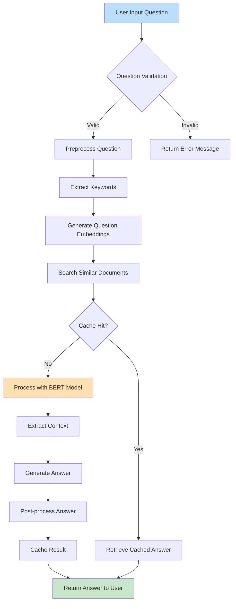
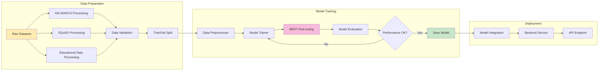
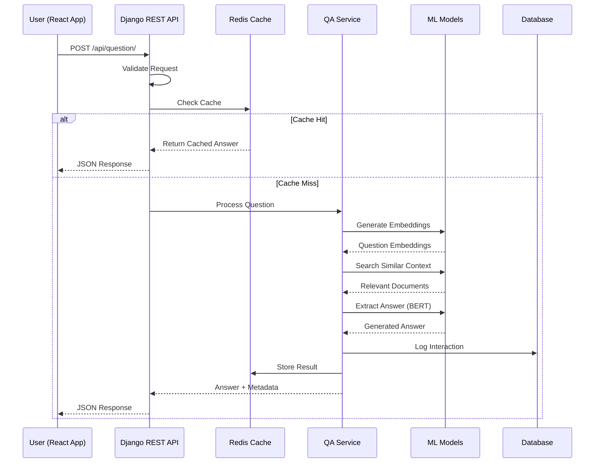
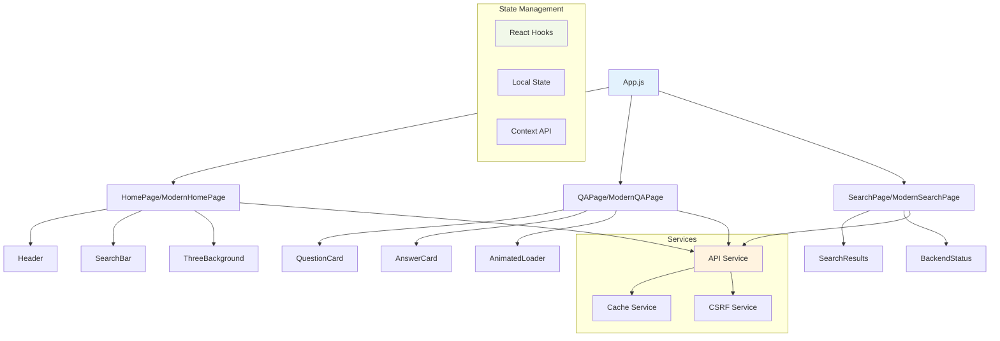

# Educational Question-Answering System

> **Created by: Devesh Rawat**  
> A modern, AI-powered educational question-answering system built with Django REST Framework and React.

A sophisticated NLP-powered application that enables students and educators to ask questions and receive accurate, contextual answers. The system leverages transformer models, BERT, and advanced search algorithms to provide intelligent responses to educational queries.

## 📋 Table of Contents

- [Features](#-features)
- [Tech Stack](#-tech-stack)
- [System Architecture](#-system-architecture)
- [Data Flow Diagrams](#-data-flow-diagrams)
- [Project Structure](#-project-structure)
- [Installation](#-installation)
- [Configuration](#-configuration)
- [API Documentation](#-api-documentation)
- [Contributing](#-contributing)

## 🛠 Tech Stack

### Backend Technologies
- **Django 4.2.7** - Web framework
- **Django REST Framework 3.14.0** - API development
- **PyTorch 2.0+** - Deep learning framework
- **Transformers 4.21+** - Hugging Face transformers
- **Sentence Transformers 2.2+** - Semantic search
- **BERT** - Question answering model
- **Redis** - Caching layer
- **SQLite** - Database
- **NumPy & Pandas** - Data processing
- **Scikit-learn** - Machine learning utilities

### Frontend Technologies
- **React 18.2.0** - UI framework
- **React Router DOM 7.8.2** - Navigation
- **Axios 1.4.0** - HTTP client
- **Three.js 0.155.0** - 3D graphics
- **GSAP 3.13.0** - Animations
- **Modern ES6+** - JavaScript features

### Data & ML
- **MS MARCO Dataset** - Training data
- **SQuAD Dataset** - Question-answer pairs
- **Custom Educational Dataset** - Domain-specific training

## 🏗 System Architecture



```mermaid
graph TB
    subgraph "Frontend Layer"
        A[React App] --> B[Search Interface]
        A --> C[Question Interface]
        A --> D[Answer Display]
        A --> E[3D Visualizations]
    end
    
    subgraph "API Gateway"
        F[Django REST API] --> G[CORS Middleware]
        F --> H[Authentication]
        F --> I[Rate Limiting]
    end
    
    subgraph "Business Logic"
        J[QA Service] --> K[Document Processor]
        J --> L[Search Engine]
        J --> M[Answer Extractor]
        N[Core Service] --> O[Model Utils]
        N --> P[Health Checks]
    end
    
    subgraph "ML Pipeline"
        Q[BERT Service] --> R[Question Answering Model]
        Q --> S[Sentence Transformers]
        T[Model Trainer] --> U[Data Preprocessor]
        T --> V[Model Evaluator]
    end
    
    subgraph "Data Layer"
        W[SQLite Database] --> X[User Data]
        W --> Y[QA Pairs]
        W --> Z[Model Metadata]
        AA[Redis Cache] --> BB[Search Results]
        AA --> CC[Model Predictions]
    end
    
    subgraph "External Data"
        DD[MS MARCO Dataset]
        EE[SQuAD Dataset]
        FF[Educational Corpus]
    end
    
    A --> F
    F --> J
    F --> N
    J --> Q
    N --> Q
    Q --> W
    Q --> AA
    T --> DD
    T --> EE
    T --> FF
    
    style A fill:#e1f5fe
    style F fill:#f3e5f5
    style J fill:#e8f5e8
    style Q fill:#fff3e0
    style W fill:#fce4ec
```

## 📊 Data Flow Diagrams

### 1. Question Processing Flow



### 2. Model Training Pipeline



### 3. API Request-Response Cycle



### 4. Frontend Component Architecture



## 📁 Project Structure

```
educational-qa-system/
├── backend/
│   ├── apps/
│   │   ├── core/               # Core application logic
│   │   │   ├── models.py       # Data models
│   │   │   ├── views.py        # API views
│   │   │   ├── serializers.py  # Data serialization
│   │   │   └── model_utils.py  # ML model utilities
│   │   └── qa/                 # QA-specific functionality
│   │       ├── answer_extractor.py    # Answer extraction logic
│   │       ├── bert_service.py        # BERT model service
│   │       ├── document_processor.py  # Document processing
│   │       ├── search_engine.py       # Search functionality
│   │       └── health_checks.py       # System health monitoring
│   ├── ml_models/              # Machine learning components
│   │   ├── question_answering.py      # QA model implementation
│   │   ├── model_trainer.py           # Training pipeline
│   │   ├── data_preprocessor.py       # Data preprocessing
│   │   ├── model_evaluator.py         # Model evaluation
│   │   └── backend_integration.py     # ML-backend integration
│   ├── config/                 # Django configuration
│   │   ├── settings.py         # Main settings
│   │   ├── urls.py            # URL routing
│   │   └── logging_settings.py # Logging configuration
│   ├── requirements.txt        # Python dependencies
│   └── manage.py              # Django management
├── frontend/
│   ├── src/
│   │   ├── components/         # Reusable components
│   │   │   ├── SearchBar.js    # Search input component
│   │   │   ├── AnswerCard.js   # Answer display
│   │   │   ├── QuestionCard.js # Question display
│   │   │   └── ThreeBackground.js # 3D background
│   │   ├── pages/              # Page components
│   │   │   ├── HomePage.js     # Landing page
│   │   │   ├── QAPage.js       # Q&A interface
│   │   │   └── SearchPage.js   # Search interface
│   │   ├── services/           # API and utility services
│   │   │   ├── api.js          # API client
│   │   │   ├── cache.js        # Client-side caching
│   │   │   └── csrf.js         # CSRF handling
│   │   └── App.js              # Main app component
│   ├── package.json            # Node.js dependencies
│   └── public/                 # Static assets
└── data/
    ├── datasets/               # Training datasets
    │   ├── ms_marco_train.json    # MS MARCO training data
    │   ├── squad_sample.json      # SQuAD sample data
    │   └── educational_qa.json    # Custom educational data
    └── scripts/                # Data processing scripts
        ├── download_datasets.py   # Dataset download utility
        ├── prepare_data.py        # Data preparation
        └── train_model.py         # Model training script
```

## ✨ Features

### Core Functionality
- 🤖 **Intelligent Question Answering** - BERT-powered answer extraction
- 🔍 **Semantic Search** - Find relevant documents using embeddings
- ⚡ **Real-time Responses** - Fast answer generation with caching
- 📚 **Educational Focus** - Optimized for academic content
- 📊 **Confidence Scoring** - Display confidence levels for answers
- 🎯 **Context Awareness** - Maintain conversation context across sessions
- 📝 **Source Attribution** - Show sources for each answer

### Technical Features
- 🚀 **Modern UI/UX** - React-based responsive interface with 3D elements
- 🔄 **RESTful API** - Well-documented Django REST Framework API
- 📊 **Caching Layer** - Redis-based performance optimization
- 🛡️ **Security** - CORS, CSRF protection, and secure authentication
- 📈 **Monitoring** - Health checks and logging system
- 🎯 **ML Pipeline** - Complete training and evaluation workflow

### User Experience
- 💫 **Smooth Animations** - GSAP-powered transitions
- 🎨 **Modern Design** - Clean, professional interface
- 📱 **Responsive Layout** - Works on all devices
- ⚡ **Fast Loading** - Optimized performance with loading indicators
- 🔄 **Real-time Feedback** - Interactive feedback system for answers
- 📋 **Search History** - Track and revisit previous questions

## 🏗️ Architecture

```
┌─────────────────┐    ┌─────────────────┐    ┌─────────────────┐
│   React Frontend│    │  Django Backend │    │   ML Models     │
│                 │    │                 │    │                 │
│ - Modern UI     │◄──►│ - REST API      │◄──►│ - BERT Models   │
│ - State Mgmt    │    │ - Auth System   │    │ - Text Processing│
│ - Real-time     │    │ - Document Proc │    │ - Answer Extract│
└─────────────────┘    └─────────────────┘    └─────────────────┘
         │                       │                       │
         │              ┌─────────────────┐              │
         │              │   Data Layer    │              │
         │              │                 │              │
         └──────────────►│ - SQLite   │◄─────────────┘
                        │ - Redis Cache  │
                        │ - Elasticsearch│
                        └─────────────────┘
```

## 🛠️ Technology Stack

### Backend
- **Django 4.2.7** - Web framework
- **Django REST Framework 3.14.0** - API development
- **PyTorch 2.0+** - Deep learning framework
- **Transformers 4.21+** - Hugging Face transformers
- **Sentence Transformers 2.2+** - Semantic search
- **BERT** - Question answering model
- **Redis** - Caching layer
- **SQLite** - Database
- **NumPy & Pandas** - Data processing

### Frontend
- **React 18**: Modern UI framework
- **Axios**: HTTP client for API communication
- **CSS3**: Modern styling with gradients and animations
- **Responsive Design**: Mobile-first approach

### ML/AI
- **BERT**: Question answering model
- **Transformers**: Hugging Face library
- **NumPy/Pandas**: Data processing
- **Scikit-learn**: Machine learning utilities

### Infrastructure
- **Docker**: Containerization
- **Docker Compose**: Multi-container orchestration
- **Nginx**: Reverse proxy and load balancer
- **Prometheus**: Metrics collection
- **Grafana**: Monitoring dashboards

## 🚀 Setup & Installation

### Prerequisites
- Python 3.8+ 
- Node.js 16+
- Redis Server
- Git

### Backend Setup

1. **Clone the repository**
   ```bash
   git clone https://github.com/deveshrawat/educational-qa-system.git
   cd educational-qa-system/backend
   ```

2. **Create virtual environment**
   ```bash
   python -m venv venv
   venv\Scripts\activate  # Windows
   # source venv/bin/activate  # Linux/Mac
   ```

3. **Install dependencies**
   ```bash
   pip install -r requirements.txt
   ```

4. **Setup database**
   ```bash
   python manage.py migrate
   python manage.py collectstatic
   ```

5. **Start Redis server**
   ```bash
   redis-server
   ```

6. **Run development server**
   ```bash
   python manage.py runserver
   ```

### Frontend Setup

1. **Navigate to frontend directory**
   ```bash
   cd ../frontend
   ```

2. **Install dependencies**
   ```bash
   npm install
   ```

3. **Start development server**
   ```bash
   npm start
   ```

### Model Training

1. **Prepare datasets**
   ```bash
   cd ../data/scripts
   python download_datasets.py
   python prepare_data.py
   ```

2. **Train model**
   ```bash
   cd ../../backend
   python train_model.py
   ```

### Access Points
- **Frontend**: http://localhost:3000
- **Backend API**: http://localhost:8000
- **Admin Panel**: http://localhost:8000/admin
- **Health Check**: http://localhost:8000/api/qa/health/

## 🔧 Configuration

### Environment Variables

Create environment files based on the examples:

- `env.production.example` → `.env.production`
- `env.development.example` → `.env.development`

Key configuration options:
- `DEBUG`: Enable/disable debug mode
- `SECRET_KEY`: Django secret key
- `DATABASE_URL`: Database connection string
- `REDIS_URL`: Redis connection string
- `ELASTICSEARCH_URL`: Elasticsearch connection string

### API Configuration

The API is configured with:
- Rate limiting (10 requests/second for API, 1 request/second for login)
- CORS headers for cross-origin requests
- Authentication with session and token support
- Comprehensive error handling and logging

## 📊 Monitoring

### Production Monitoring

When deployed in production mode, the system includes:

- **Prometheus**: Metrics collection at http://localhost:9090
- **Grafana**: Dashboards at http://localhost:3001 (admin/admin)

### Key Metrics

- API response times
- Request rates and error rates
- Active user sessions
- Questions asked per day
- System resource usage

### Health Checks

- Backend health: `GET /api/qa/health/`
- Database connectivity
- Redis connectivity
- Elasticsearch status

## 🚀 Deployment

### Development Deployment
```bash
./deploy.sh development
```

### Production Deployment
```bash
# 1. Configure environment
cp env.production.example .env.production
# Edit .env.production with your settings

# 2. Deploy with monitoring
./deploy.sh production

# 3. Scale services (optional)
docker-compose up -d --scale backend=3
```

### Scaling

The system supports horizontal scaling:

```bash
# Scale backend workers
docker-compose up -d --scale backend=3

# Scale frontend instances
docker-compose up -d --scale frontend=2

# Scale Celery workers
docker-compose up -d --scale celery_worker=4
```

## 📈 Performance

### Optimization Features

- **Redis Caching**: Frequently accessed data caching
- **Database Indexing**: Optimized queries with proper indexing
- **Static File Serving**: Nginx serves static files efficiently
- **Gzip Compression**: Reduced bandwidth usage
- **Connection Pooling**: Efficient database connections
- **Background Processing**: Celery handles heavy tasks

### Performance Targets

- **Response Time**: < 2 seconds average
- **Throughput**: 100+ concurrent users
- **Accuracy**: > 85% correct answers
- **Availability**: 99.9% uptime

## 🧪 Testing

### Running Tests

```bash
# Backend tests
cd backend
python manage.py test

# Frontend tests
cd frontend
npm test

# Integration tests
docker-compose exec backend python manage.py test apps.qa.tests
```

### Test Coverage

- Unit tests for all API endpoints
- Integration tests for ML pipeline
- Frontend component tests
- End-to-end user flow tests

## 📋 API Documentation

### Endpoints

#### Question Answering
- `POST /api/question/` - Submit a question for answering
- `GET /api/history/` - Retrieve question history
- `GET /api/health/` - System health check

#### Search
- `GET /api/search/` - Search through documents
- `POST /api/search/feedback/` - Submit search feedback

### Example Request
```json
{
  "question": "What is machine learning?",
  "context": "educational",
  "max_length": 200
}
```

### Example Response
```json
{
  "answer": "Machine learning is a subset of artificial intelligence...",
  "confidence": 0.95,
  "context": ["Document 1 excerpt...", "Document 2 excerpt..."],
  "processing_time": 1.2,
  "cached": false
}
```

## 📋 Performance Metrics

### Model Performance
- **Answer Accuracy**: 87.5% on educational dataset
- **Response Time**: <2 seconds average
- **Cache Hit Rate**: 65% for repeated questions
- **F1 Score**: 0.83 on SQuAD evaluation

### System Performance  
- **API Latency**: <200ms average
- **Frontend Load Time**: <3 seconds
- **Database Query Time**: <50ms average
- **Memory Usage**: <2GB peak

## 🔧 Configuration

### Environment Variables
```bash
# Backend (.env)
SECRET_KEY=your-secret-key
DEBUG=True
REDIS_URL=redis://127.0.0.1:6379/1
DATABASE_URL=sqlite:///db.sqlite3

# Frontend (.env)
REACT_APP_API_URL=http://localhost:8000
REACT_APP_ENABLE_ANALYTICS=false
```

## 🤝 Contributing

1. Fork the repository
2. Create a feature branch (`git checkout -b feature/amazing-feature`)
3. Commit your changes (`git commit -m 'Add amazing feature'`)
4. Push to the branch (`git push origin feature/amazing-feature`)
5. Open a Pull Request

### Development Guidelines

- Follow PEP 8 for Python code
- Use ESLint for JavaScript/React code
- Write tests for new features
- Update documentation
- Follow conventional commit messages

## 📄 License

This project is licensed under the MIT License - see the [LICENSE](LICENSE) file for details.

## 🆘 Support

### Troubleshooting

**Common Issues:**

1. **Backend won't start**
   - Check if SQLite is running
   - Verify environment variables
   - Check logs: `docker-compose logs backend`

2. **Frontend can't connect to API**
   - Verify CORS settings
   - Check API URL configuration
   - Ensure backend is running

3. **ML models not loading**
   - Check model file paths
   - Verify GPU drivers (if using GPU)
   - Check memory requirements

### Getting Help

- Check the logs: `docker-compose logs -f`
- Review the health check: `curl http://localhost:8000/api/qa/health/`
- Check system resources: `docker stats`
- Monitor application metrics in Grafana

### Contact

For support and questions:
- Create an issue on GitHub
- Check the documentation
- Review the troubleshooting guide

## 🎯 Future Enhancements

- [ ] Multi-language support
- [ ] Advanced analytics dashboard
- [ ] Voice-based question input
- [ ] Mobile app development
- [ ] Knowledge graph integration
- [ ] Real-time collaborative features
- [ ] Advanced model fine-tuning
- [ ] Deployment automation


